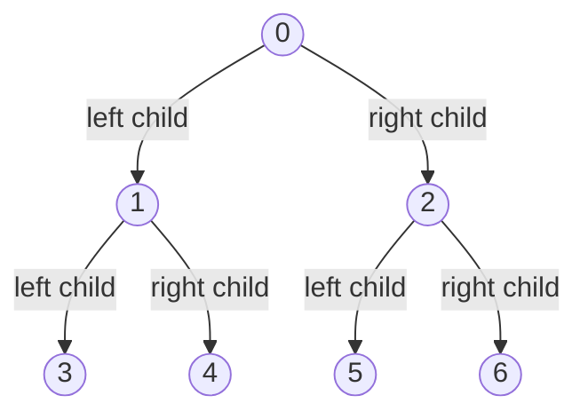

# BinaryTree
## Contributors: Leo

If given list of Node:
[0, 1, 2, 3, 4, 5, 6], 

```mermaid
flowchart TD
    A((0))
    B((1))
    C((2))
    D((3))
    E((4))
    F((5)) 
    G((6)) 
    A -- left child--> B
    B -- left child --> D
    B -- right child --> E
    
    
    A -- right child --> C
    C -- left child --> F
    C -- right child --> G
    
```
    